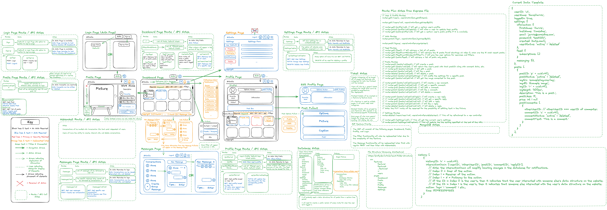

# ArtMarket

## Overview

ArtMarket is a prototype fullstack ecommerce application designed to enable independent artists to feature, sell, and distribute their work online.

However, I do not intend to use the website for this stated purpose.  Instead, the real goal is to build a portfolio project that I can continuously add features to indefinitely.  That way I will always be building my skills as a developer while also having a well-documented code base showing my development over time.

## Developer Environment Installation

Follow these steps to setup up the project on your local machine:

1. In your terminal, clone the repo.
   ```sh
   git clone git@github.com:roryemagee1/artmarket.git
   ```
2. Change the directory to the root directory.
   ```sh
   cd artmarket
   ```
3. Install NPM packages for the backend in the root directory.
   ```sh
   npm install
   ```
4. Change the directory to the frontend directory.
   ```sh
   cd frontend
   ```
5. Install NPM packages for the frontend in the frontend directory.
   ```sh
   npm install
   ```
6. In the frontend folder, start the vite development server on localhost:5173.
   ```sh
   npm run dev
   ```
7. Open a new tab in your terminal.
8. Return to the project's root directory and start the express development server on localhost:3000.
   ```sh
   cd ..
   npm start
   ```
9. Open [localhost:5173](localhost:5173) in a modern internet browser to view the project.

# Project Details

ArtMarket is based off of a project called [Myseum](https://github.com/roryemagee1/myseum), which I made while attending the Turing School of Software Design & Development.  Originally I worked on another version of the project titled [Artvolia](https://github.com/roryemagee1/artvolia-fe).  

But after realizing the project used too many new technologies at once and was too large to complete as designed within a year, I decided to start over with a much more streamlined "Minimum Viable Product" version, which became ArtMarket.  However, the longterm goal is still to incrementally add features to ArtMarket until it evolves into Artvolia.

## Design Concept

Here is the original design prototype for Artvolia, a social media ecommerce application for independent artists:




## ArtMarket MVP Features

### Frontend Architecture

### Frontend Features by User Story

### Frontend Technology

- React and Vite
- Redux Toolkit
- TypeScript
- PayPal
- React Router
- React Loading
- React Awesome Slider
- React Helmet
- React Icons
- React Toastify

### Backend Architecture

### Backend Features by REST API Routes

### Backend Technology

- Node and Express
- Bcrypt
- Mongoose
- Multer
- JSON Web Tokens

## Artvolia Features Left to Implement

- Messaging chat functionality implemented with Websockets
- Unit Testing, End to End Testing with Mocha, Chai, and Cypress
- Continuous Integration testing with GitHub Actions
- Individual user store functionality and administration
- Individual public user profile pages for featuring art
- Social Media functionality, including liking, commenting, and subscribing
- Notification functionality for all user site interactions
- Email integration for account information and password reset functionality
- Comprehensive Settings functionality including profile customization and privacy
- Search engine optimization

### Features

### Technology

## Credit 

